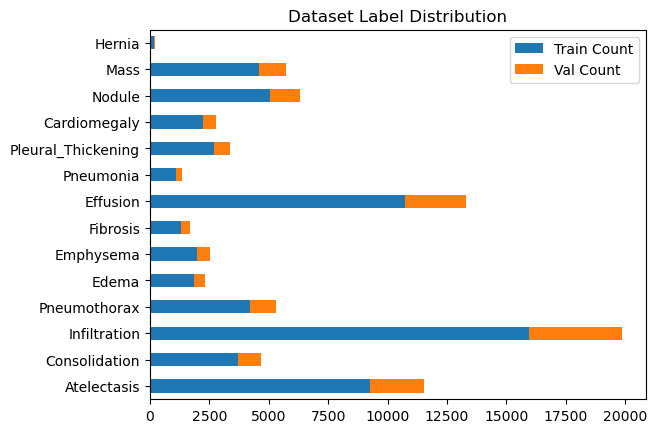
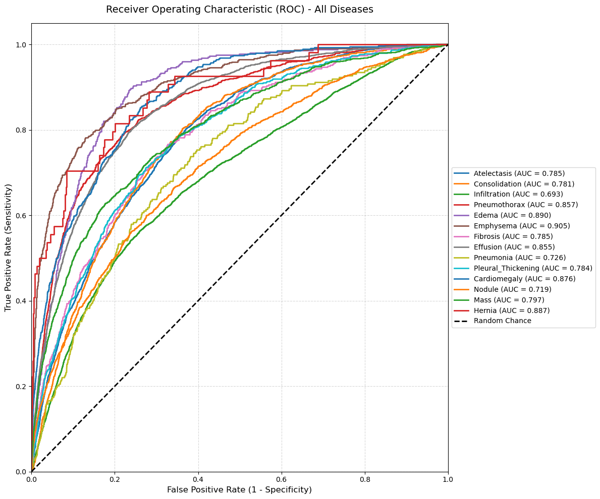
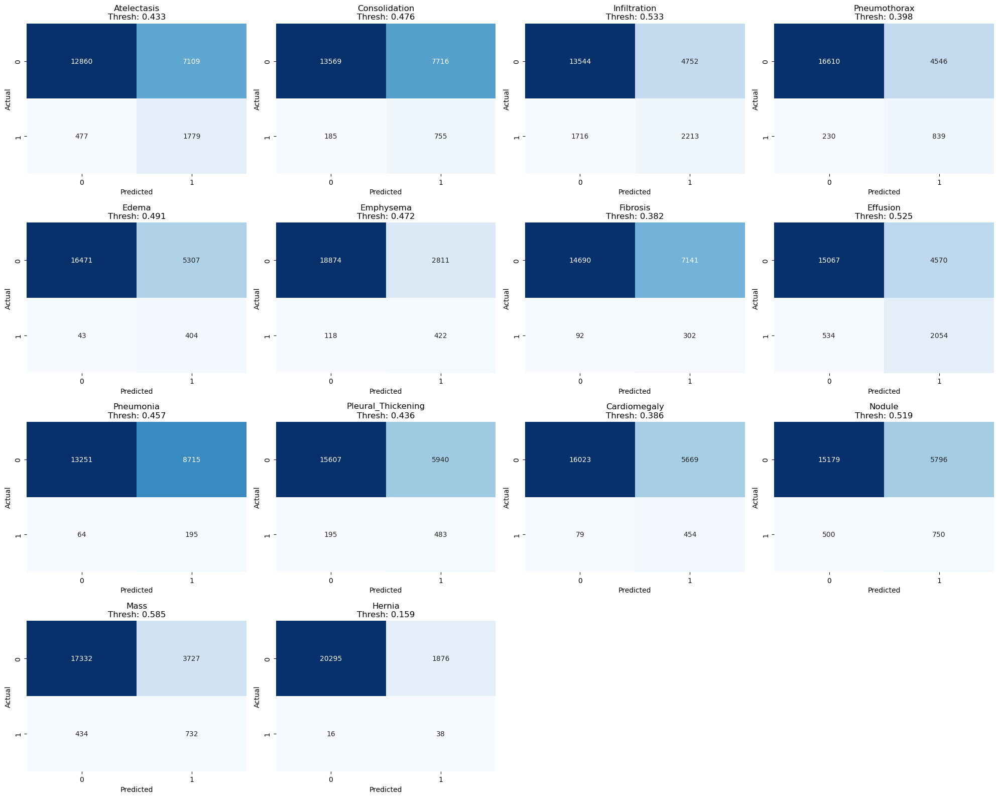

# Medical Images - CNN Project

## Authors: Krzysztof Nowak, Paweł Siurek

An end-to-end deep learning project utilizing CNNs for a multi-label classification problem of 14 distinct radiological findings from chest radiographs, using the NIH Chest X-ray14 dataset.

**Note:** This project emphasizes patient safety and high recall, attempting to aggresively minimize false negatives to ensure potential diseases are caught for a secondary human review.

Source of the data: [AcademicTorrents](https://academictorrents.com/details/557481faacd824c83fbf57dcf7b6da9383b3235a)

## Acknowledgments
* **Architecture Inspiration:** The core model strategy (EfficientNet backbone with a custom sequential classification head) and the approach to handling the dataset imbalance were heavily inspired by the methodology outlined in: 
  > [*Multi-Label Classification of Chest X-ray Abnormalities Using Transfer Learning Techniques*](https://pubmed.ncbi.nlm.nih.gov/37888037/) (2023). We extend our gratitude to the authors of this study, whose foundational research validated the EfficientNet approach on this dataset, allowing us to confidently focus our efforts on threshold optimization and pipeline engineering.

## Model Architecture & Strategy
* **Base Model:** `EfficientNet` (Pre-trained on ImageNet). This specific architecture was selected based on its proven success with the NIH ChestX-ray14 dataset, as detailed in [this 2023 research paper](https://pubmed.ncbi.nlm.nih.gov/37888037/).
* **Custom Head:** The network's classifier was replaced with a custom linear layer outputting 14 logits, one for each disease class.
* **Loss Function:** `BCEWithLogitsLoss` (Binary Cross Entropy) to handle the multi-label nature of the data, treating each finding as an independent probability.

## Dealing with Extreme Class Imbalance
Medical datasets are notoriously imbalanced (e.g., thousands of "Infiltration" cases vs. only a few hundred "Hernia" cases). We tackled this via:
1. **Evaluation Metric (AUC-ROC):** Instead of raw accuracy (which is heavily biased by the majority negative class), we evaluated the model using the Area Under the Receiver Operating Characteristic Curve.
2. **High-Recall Thresholding:** Using the ROC curve, we extracted custom decision thresholds for *each individual disease*. Thresholds were intentionally skewed to prioritize **High Recall**, minimizing False Negatives at all costs.



## Model Evaluation & Scores
Evaluating a multi-label deep learning model on a medical dataset with extreme class imbalance requires moving beyond standard accuracy metrics. A naive model predicting "No Finding" for every X-ray would achieve artificially high accuracy while completely failing in a clinical setting. That's why we have introduced ROC-AUC scores as our default metric.

**Receiver Operating Characteristic Curves**

The plot below demonstrates the model's true positive rate against the false positive rate across all targeted pathological findings.



**Confusion Matrices (Applied Thresholds)**

By applying our custom high-recall thresholds, we fundamentally shifted the prediction distribution. In the matrices below, notice the aggressive minimization of False Negatives (the bottom-left quadrant of each matrix) for critical findings.



## Reproducing the Project

### 1. Clone the repository
```bash
git clone https://github.com/siwens77/CNN-project
cd CNN-project
```

### 2. Create a Virtual Environment
#### On Windows:
```bash
python -m venv venv

venv\Scripts\activate
```

#### On macOS/Linux:
```bash
python3 -m venv venv

source venv/bin/activate
```

### 3. Install Dependencies
```bash
pip install -r requirements.txt
```

### 4. Download the Model Weights
#### Located in GitHub Release - due to the file size

### 5. Run the Notebook 
